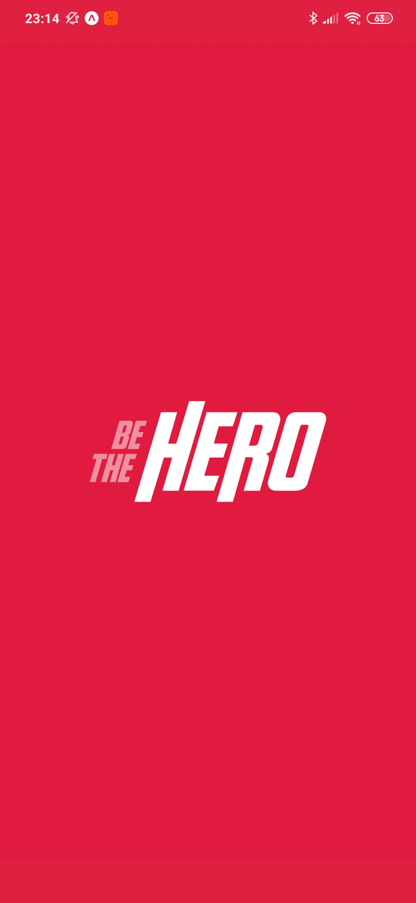
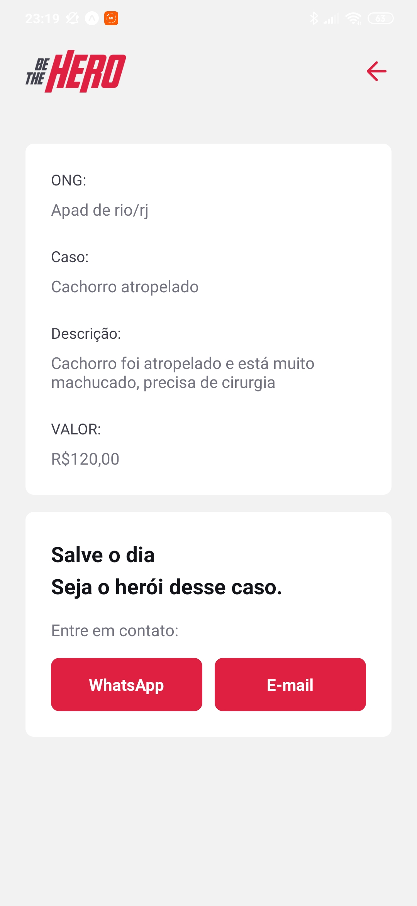
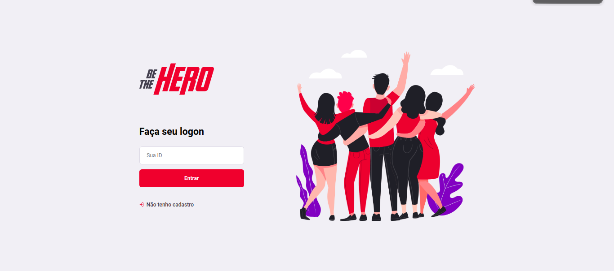
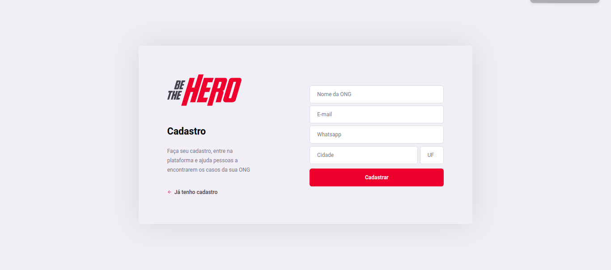
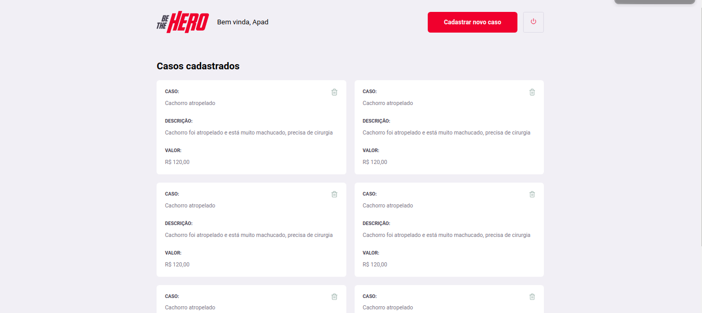
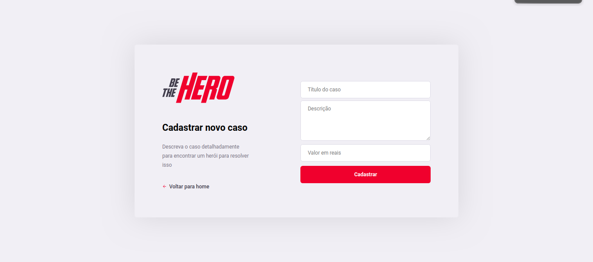

<h4 align="center">
 
 <b>Seja um verdadeiro Heroi!</b> 🦸‍♂️
</h4>

  

  <a href="#tecnologias-utilizadas">Tecnologias</a>&nbsp;&nbsp;&nbsp;|&nbsp;&nbsp;&nbsp;
  <a href="#sobre">Sobre</a>&nbsp;&nbsp;&nbsp;|&nbsp;&nbsp;&nbsp;
  <a href="#aplicação">Aplicação</a>

 

## Tecnologias utilizadas

- [Node.js](https://nodejs.org/en/)
- [Expo](https://expo.io/)
- [Express](https://expressjs.com/pt-br/)
- [React](https://pt-br.reactjs.org/)

## Sobre
<b>Be The Hero</b> trata-se de um projeto que visa conectar pessoas interessadas em ajudar à uma ONG. Nessa aplicação as instituições podem cadastrar casos e esperar um herói para ajudá-las.

## Aplicação
Foi implementado o backend, frontend e o mobile da aplicação

  
  
  
  
  
  
  

